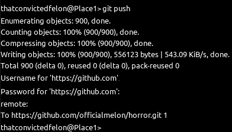
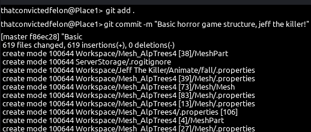
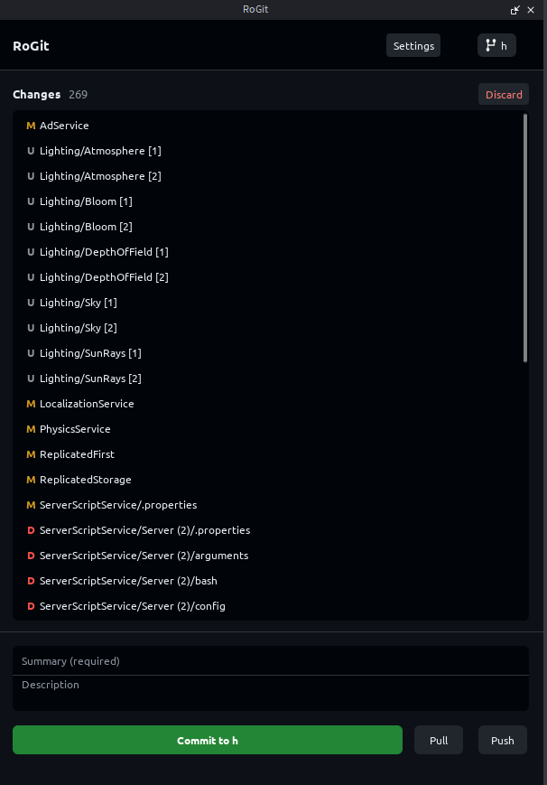

# roGit

> **Roblox version control using the native git protocol (HTTPS).**


---

## Screenshots

| Preview 1 | Preview 2 | Preview 3 |
| :---: | :---: | :---: |
|  |  |  |

---

## About `roGit`

**roGit** is a pure-Luau port of Git designed to run directly within **Roblox Studio**. It fundamentally allows developers to interact with the Git protocol (`https://`) to clone, commit, pull, and push Roblox Instances natively.
While Rojo does exist, this is a pure luau implementation for ROBLOX. Meaning NO external tools are needed (such as rojo, external git)
We have implemented a console to give the user a native git feel if they are advanced, as well as a "Github Desktop"-esque plugin for easier repository managment

**Experimental Plugin** 
> This plugin is experimental, contains bugs, and *can* cause data loss in your experience. I am **not** responsible for any lost work. Use entirely at your own risk!
> Editing the repository directly via third party means (i.e not through Roblox Studio) may cause corruption and damage to your projects.

*Note: This is strictly a hobby project. Meaningful updates or stability patches are not guaranteed.*

---

## Features to implement

- [ ] Implement MInstance instead of custom solution! (better support)

- [ ] Make branching much better

- [x] Improve speeds

## Features & Supported Commands

`roGit` currently supports a subset of standard Git commands, adapted for the Roblox `Instance` tree:

- `git clone <url>` - Clone remote repositories directly into Workspace.
- `git status` - View modified, added, and staged Instances.
- `git add <path>` - Stage specific Instances or properties for commit.
- `git commit -m "..."` - Create local commits natively.
- `git push` & `git pull` - Sync with remote HTTPS repositories (GitHub, GitLab, etc.).
- `git checkout` & `git switch` - Checkout at a certain branch or commit.
- `git branch`, `git diff`, `git fetch`, `git config` and more!

---

## Installation

1. Navigate to the **Releases** page on this repository.
2. Download the latest plugin file.
3. Open **Roblox Studio** and open any Experience.
4. From the top toolbar, go to **Plugins** > **Plugins Folder**.
5. Copy the downloaded plugin file into the window that opens.
6. Restart **Roblox Studio**. The plugin will now appear in your toolbar as **"Git Terminal"** and **"RoGit"**.

---
## Example
> WARNING: You may experience lag for a short period (15-20~ seconds), this is where the instances are cloning.
- Lets start by cloning in a repository (this is the original crossroads map!):
```
git clone https://github.com/officialmelon/crossroads-rogit.git
```
