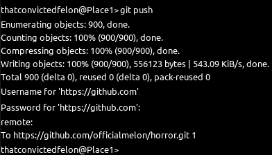
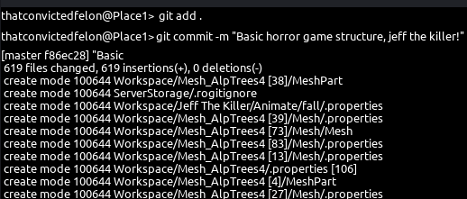
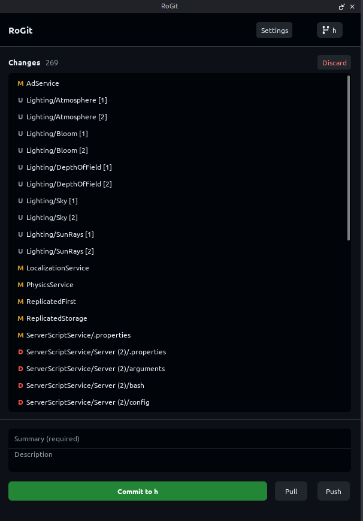

# roGit

> **Roblox version control using the native git protocol (HTTPS).**


---

## Screenshots

| Preview 1 | Preview 2 | Preview 3 |
| :---: | :---: | :---: |
|  |  |  |

---

## About `roGit`

**roGit** is a pure-Luau port of Git designed to run directly within **Roblox Studio**. It fundamentally allows developers to interact with the Git protocol (`https://`) to clone, commit, pull, and push Roblox Instances natively.
While Rojo does exist, this is a pure luau implementation for ROBLOX. Meaning NO external tools are needed (such as rojo, external git)
We have implemented a console to give the user a native git feel if they are advanced, as well as a "Github Desktop"-esque plugin for easier repository managment

**Experimental Plugin** 
> This plugin is experimental, contains bugs, and *can* cause data loss in your experience. I am **not** responsible for any lost work. Use entirely at your own risk!
> Editing the repository directly via third party means (i.e not through Roblox Studio) may cause corruption and damage to your projects.

*Note: This is strictly a hobby project. Meaningful updates or stability patches are not guaranteed.*

---

## Features to implement

- [ ] Union/Combined-Instance support *(binary properties such as `ChildData`/`MeshData` are stored (base64) instead of breaking the commit, but whether Studio lets a plugin read/write them still needs testing. `git doctor` tells you what is and isn't saved in your place)*

## Features & Supported Commands

`roGit` aims to behave like git, adapted for the Roblox `Instance` tree (every instance is a "file").
Run `git help` for the list, `git <command> --help` for the options of one command.

**Start a repository**
- `git init [-b <branch>]`, `git clone [-b <branch>] [--single-branch] <url>` (https, `git@host:user/repo.git` and `host/user/repo` URLs).

**Day to day**
- `git status [-s] [-b] [--porcelain]` - staged, unstaged, untracked and unmerged instances, ahead/behind your upstream, merges/rebases in progress.
- `git add [-u] [-A] [-n] <path>`, `git rm [-r] [--cached] [-f]`, `git mv`, `git restore [--staged] [--source=<rev>]`, `git clean [-n] [-f]`.
- `git commit [-m] [-a] [--amend] [--no-edit] [-e] [--allow-empty] [--author=] [-C <commit>] [-S] [-n]` - without `-m` the message is written in a Studio script (see [The editor](#the-editor)).
- `git diff [--cached] [<commit>] [<a> <b> | <a>..<b> | <a>...<b>] [--stat | --name-only | --name-status] [-- <path>]` - every changed property, and a line diff for scripts.
- `git stash [push -u -m] | list | show [-p] | pop | apply | drop | clear | branch`.

**History**
- `git log [--oneline] [--graph] [--all] [-n] [-p | --stat] [--author=] [--grep=] [--format=] [--reverse] [<range>] [-- <path>]`.
- `git show [<rev>] [<rev>:<path>]`, `git blame <path>`, `git grep <pattern> [<rev>]`, `git shortlog [-sne]`, `git describe [--tags]`.
- `git reflog`, and `HEAD@{n}`, `ORIG_HEAD`, `HEAD~2`, `main^2`, `@{u}`, `@{-1}` as revisions anywhere.

**Branches and merging**
- `git branch [-a] [-r] [-v] [-vv] [-d/-D] [-m] [-c] [-u <upstream>] [--merged] [--no-merged] [--contains]`.
- `git switch [-c] [--detach] [-] <branch>`, `git checkout [-b] <branch> | <commit> | [<rev>] -- <path>`.
- `git merge [--no-ff] [--ff-only] [--squash] [--no-commit] [-X ours|theirs] [--abort | --continue]`.
- `git rebase [-i] [-x <cmd>] [--onto] <upstream>`, `git cherry-pick [-x] [-n] <commits>`, `git revert <commits>` - all with `--continue`, `--skip`, `--abort`.
  `rebase -i` supports `pick`, `reword`, `edit`, `squash`, `fixup`, `exec`, `break` and `drop`.
- `git reset [--soft | --mixed | --hard] [<commit>] [-- <path>]`, `git tag [-a] [-s] [-m] [-d] [-l]`, `git bisect`.
- `git worktree add | list | remove | prune | lock | unlock | move`, `git submodule add | status | init | update | deinit | foreach | sync | summary`.

**Remotes**
- `git fetch [--all] [--prune]`, `git pull [--rebase] [--ff-only]`, `git push [-u] [-f] [--force-with-lease] [--all] [--tags] [--delete] [-n] [src:dst]`, `git remote add | remove | rename | set-url | get-url | show | prune`.
- Only the objects you don't have yet are downloaded or uploaded.

**Plumbing**
- `git cat-file`, `ls-files`, `ls-tree`, `rev-parse`, `rev-list`, `merge-base`, `show-ref`, `symbolic-ref`, `update-ref`, `count-objects`, `git config [--global] [--list] [--get] [--unset]`.

**Global options**
- `git -C <worktree | submodule> <command>` runs a command in another worktree or a submodule (`cd <name>` does the same for every command in the terminal, `cd` alone goes back).
- `git -c <name>=<value> <command>` sets a config value for one command.

**Signing, hooks and logs**
- `git signing-key generate | import | show | remove`, `git verify-commit`, `git verify-tag`, `git log --show-signature`, `%G?` / `%GK` in `--format`.
- `git hook list | create | run | remove`.
- `git activity` (what was run in this place, by whom, and whether it worked), `rogit.trace` for live tracing.

**roGit specific**
- `git doctor` - scans your place and lists everything roGit can't store.

### What gets saved

Every property Studio reports as serialized, attributes, tags and scripts are stored. On top of that:

- **Terrain**: the voxels (materials, occupancy and water, in 128 stud chunks) and the terrain material colors.
  roGit finds the terrain by itself; for huge maps set a `RoGitTerrainBounds` attribute on Terrain (`"x1,y1,z1,x2,y2,z2"` in studs).
- **`EditableImage`** (pixels) and **`EditableMesh`** (vertices, normals, UVs, colors, triangles), and `Content` properties that point at them (e.g. `ImageLabel.ImageContent`, `MeshPart.MeshContent`).
- **`Path2D`** control points, `Model.WorldPivot`, `buffer` and binary-string properties.
- Cleared values: an attribute, tag, reference (`ObjectValue.Value`, `Model.PrimaryPart`...) or custom physical properties removed on a branch are removed again when you check it out.
- Scripts open in the editor are read from (and written through) the script editor.
- Awkward instance names (`A/B`, empty names, `.git`, ...) are escaped so they can live in a git tree.
- Properties of a type roGit doesn't understand are skipped rather than saved as junk; `git doctor` lists them.

### How merging works

Instances are stored as property lists, so `git merge`, `git pull`, `git rebase`, `git cherry-pick`, `git revert` and `git stash pop` merge in layers:

1. **Instances**: added/removed/changed on only one side - taken as is.
2. **Properties**: an instance edited on both sides is merged property by property (attributes and tags too).
3. **Scripts**: if both sides edited the same script, the lines are merged like git does. Edits to different parts of the file merge cleanly.

When both sides really changed the same thing, you get a git-style conflict: scripts get `<<<<<<<` / `=======` / `>>>>>>>` markers,
other instances keep your version, and `git status` lists the unmerged paths. Fix them, `git add` them and `git commit`
(or `git rebase --continue`, `git cherry-pick --continue`, ...). `git merge --abort` (and friends) puts everything back.
`-X ours` / `-X theirs` settles conflicts automatically.

### The editor

Commands that open an editor in git (`git commit` without `-m`, `git merge -e`, `git tag -a` without `-m`, `git rebase -i`,
`git signing-key import`) open a temporary script in Studio instead. Lines starting with `--` are comments and are dropped,
like `#` lines in git. Write the message (or edit the rebase todo list), then **close the script tab** to continue.
An empty message aborts the commit, like git.

### Hooks

Hooks are `ModuleScript`s in `ServerStorage/.git/hooks` (or the folder `core.hooksPath` names) that return a function:

```lua
-- ServerStorage/.git/hooks/commit-msg
return function(context)
    -- context.name, context.args, and context.git(...) to run git commands
    if not context.message:match("^%u") then
        return false, "start the commit message with a capital letter" -- stops the commit
    end
    return true
end
```

`git hook create pre-commit` makes one from a template and opens it. Supported: `pre-commit`, `prepare-commit-msg`, `commit-msg`
(return a string to change the message), `post-commit`, `pre-merge-commit`, `post-merge`, `pre-rebase`, `post-rewrite`,
`post-checkout` and `pre-push` (`context.updates` lists the refs). `--no-verify` skips them. Hooks live in the place, so
everyone in Team Create runs the same ones.

### Signed commits

roGit signs commits and tags with SSH keys (ed25519), the same format as `git config gpg.format ssh`, so GitHub and GitLab
show them as **Verified**:

```
git signing-key generate                 # prints the public key
git config --global commit.gpgsign true  # sign every commit (or use git commit -S, git tag -s)
```

Add the printed public key on GitHub under *Settings > SSH and GPG keys > New SSH key*, with *Key type: Signing Key*, and make sure
`git config --global user.email` is an email of that account. `git signing-key import` uses an existing unencrypted OpenSSH ed25519 key
instead. The private key is kept in your plugin settings, never inside the place. Check signatures with `git verify-commit`,
`git verify-tag` or `git log --show-signature`.

### Worktrees

```
git worktree add hotfix              # new branch "hotfix", checked out into ServerStorage/RoGitWorktrees/hotfix
git -C hotfix status                 # or: cd hotfix, then plain git commands
git -C hotfix commit -am "Fix spawn"
git merge hotfix                     # back in the place
git worktree remove hotfix
```

A worktree is a folder holding a copy of the services (`Workspace`, `ReplicatedStorage`, ...) at another commit, so you can look at
or fix another branch without touching the place. It has its own `HEAD`, index and merge/rebase state; branches, tags, config and
objects are shared. A branch can only be checked out in one worktree at a time. Worktree folders are never tracked by the place.
Service properties (like `Lighting.ClockTime`) are kept as they are in a worktree, since the folders aren't real services.

### Submodules

```
git submodule add https://github.com/you/your-lib.git ReplicatedStorage/Packages/YourLib
git commit -m "Add YourLib"
git submodule update --remote        # move to the library's newest commit
git submodule update --init          # after cloning a place that has submodules (or: git clone --recurse-submodules)
```

A submodule is a folder holding another roGit repository, pinned to a commit. The place's tree records just that commit (a real
git "gitlink", mode `160000`, so it shows as a submodule on GitHub too). The library's contents go inside the folder:
its `ReplicatedStorage/Lib` becomes `ReplicatedStorage/Packages/YourLib/ReplicatedStorage/Lib`. Its repository lives in
`.git/modules/<name>`, and the settings in `ServerStorage/.gitmodules`. Use `git -C <path> <command>` or
`git submodule foreach <command>` to work inside it. Submodules must be roGit repositories.

### Logs and tracing

- `git activity` shows the last commands run in the place: when, by whom, how long they took and the error if they failed
  (`--failed`, `--author=`, `--grep=`, `-n`, `--clear`). It is kept in `.git/logs/activity` (the last 500 commands), so Team Create
  collaborators see each other's commands. `git config rogit.activityLog false` turns it off.
- `git config --global rogit.trace true` (or `git -c rogit.trace=1 <command>` once) prints what roGit is doing, like `GIT_TRACE`:
  every command (including ones run by other commands and hooks), every HTTP request with its status, size and time, hooks,
  worktree/submodule switches and timings. `rogit.trace` can also be a list of kinds: `run`, `http`, `hook`, `context`, `perf`.
- `git reflog` still records where `HEAD` and each branch have been.

### Differences from git

- **No SSH transport.** Roblox plugins can only make HTTP(S) requests (`HttpService`); there are no raw sockets, so the SSH
  protocol can't be spoken. SSH URLs (`git@github.com:user/repo.git`) are converted to HTTPS, use a personal access token to
  authenticate. (SSH *keys* are supported for signing, see above.)
- The editor is a Studio script you close when done, instead of `$EDITOR`.
- Hooks are Luau ModuleScripts instead of shell scripts; `exec` in `rebase -i` and `submodule foreach` run git commands, not shell commands.
- `git grep` patterns are plain text (`-E` switches to Lua patterns, not regular expressions).
- Worktrees live in `ServerStorage/RoGitWorktrees`; submodules must be roGit repositories.
- Sparse checkout, LFS, GPG/X.509 signing and the dumb HTTP protocol aren't supported.

---

## Installation

1. Navigate to the **Releases** page on this repository.
2. Download the latest plugin file.
3. Open **Roblox Studio** and open any Experience.
4. From the top toolbar, go to **Plugins** > **Plugins Folder**.
5. Copy the downloaded plugin file into the window that opens.
6. Restart **Roblox Studio**. The plugin will now appear in your toolbar as **"Git Terminal"** and **"RoGit"**.

---
## Example
> WARNING: You may experience lag for a short period (15-20~ seconds), this is where the instances are cloning.
- Lets start by cloning in a repository (this is the original crossroads map!):
```
git clone https://github.com/officialmelon/crossroads-rogit.git
```
- Make some changes, then look at them, commit and push:
```
git status
git diff
git add .
git commit -m "Tweak the map"
git push
```
- Work on a branch and merge it back:
```
git switch -c lighting-pass
git commit -am "Warmer lighting"
git switch master
git merge lighting-pass
```

---

## Development

The plugin is plain Luau and builds with [Rojo](https://rojo.space) (`rojo build -o roGit.rbxm`).

`tests/` contains a small Roblox mock so the real command code can be exercised outside Studio with the [Luau CLI](https://github.com/luau-lang/luau):

```
for t in merge workflow serialize history parity tools worktree; do
  python3 tests/build.py tests/${t}_test.lua && luau tests/_run.lua
done
```

`tests/verify_signature.py` checks roGit's commit signatures independently (with Python's `cryptography`):
`luau tests/_run.lua > out.txt` after building `tools_test.lua`, then `python3 tests/verify_signature.py out.txt`.
